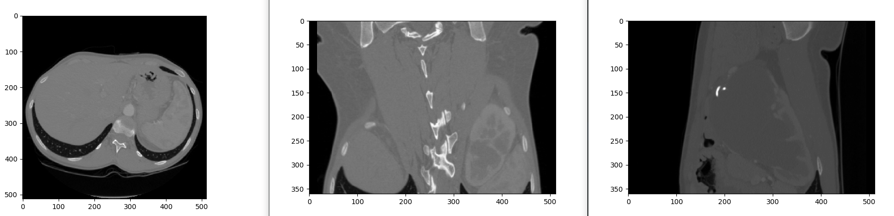

# Multiplanar Reconstruction

The acquired data (axial plane), will be converted to nonaxial planes such as coronal, sagittal and transverse.

It is most commonly performed with volumetric computed tomography slice data in the axial plane, but it can be performed with scanning in any plane and any modality capable of generating cross-sectional images, that is, magnetic resonance imaging (MRI).



## Requirements
- python
- numpy
- [matplotlib](https://matplotlib.org/)


## Getting Started
Unzip the `Arterielle-RAW.zip` file and replace the `./Arterielle` folder with the volumetric slice data content in the extracted folder
````
python main.py
````

## License

[MIT license](LICENSE)

